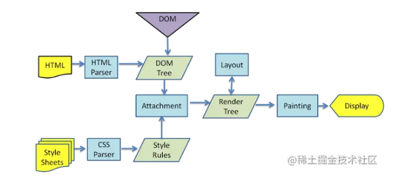

##### 1. 谈谈你对作用域链的理解(有赞一面)

> 小提示：同类型的问题还可以是原型链、继承、闭包等，这种概念性的问题你肯定不是一句两句能说清楚的，建议在理解之后自己尝试总结一下，如何把重要的知识点用简短的话语说明白。

了解作用域链之前我们要知道一下几个概念：

- 函数的生命周期
- 变量和函数的声明
- Activetion Object（AO）、Variable Object（VO）

函数的生命周期：

- 创建：JS解析引擎进行预解析，会将函数声明提前，同时将该函数放到全局作用域中或当前函数的上一级函数的局部作用域中。
- 执行：JS引擎会将当前函数的局部变量和内部函数进行声明提前，然后再执行业务代码，当函数执行完退出时，释放该函数的执行上下文，并注销该函数的局部变量。

变量和函数的声明：如果变量名和函数名声明时相同，函数优先声明。

Activetion Object（AO）、Variable Object（VO）：

- AO：Activetion Object（活动对象）
- VO：Variable Object（变量对象）

VO对应的是函数创建阶段，JS解析引擎进行预解析时，所有的变量和函数的声明，统称为Variable Object。该变量与执行上下文相关，知道自己的数据存储在哪里，并且知道如何访问。VO是一个与执行上下文相关的特殊对象，它存储着在上下文中声明的以下内容：

- 变量 (var, 变量声明);
- 函数声明 (FunctionDeclaration, 缩写为FD);
- 函数的形参

AO对应的是函数执行阶段，当函数被调用执行时，会建立一个执行上下文，该执行上下文包含了函数所需的所有变量，该变量共同组成了一个新的对象就是Activetion Object。该对象包含了：

- 函数的所有局部变量
- 函数的所有命名参数
- 函数的参数集合
- 函数的this指向

作用域链：

当代码在一个环境中创建时，会创建变量对象的一个作用域链（scope chain）来保证对执行环境有权访问的变量和函数。作用域第一个对象始终是当前执行代码所在环境的变量对象（VO）。如果是函数执行阶段，那么将其activation object（AO）作为作用域链第一个对象，第二个对象是上级函数的执行上下文AO，下一个对象依次类推。

在《JavaScript深入之变量对象》中讲到，当查找变量的时候，会先从当前上下文的变量对象中查找，如果没有找到，就会从父级(词法层面上的父级)执行上下文的变量对象中查找，一直找到全局上下文的变量对象，也就是全局对象。这样由多个执行上下文的变量对象构成的链表就叫做作用域链。


##### 2. 你知道`null`和`undefined`有什么区别么(有赞一面)

##### 3. 闭包有什么作用

###### 闭包定义：

当函数可以记住并访问所在的词法作用域，就产生了闭包。即使函数是在当前词法作用域之外执行。
闭包使得函数在外部调用时，可以继续访问定义时的词法作用域。
只要使用了回调函数，实际上就是在使用闭包！
—— 摘自《你所不知道的js》

简单来说就是：

- 父函数的返回值是一个子函数
- 子函数可以访问父函数中的作用域

###### 缺陷：

- 闭包引用了祖先函数的作用域，所以滥用闭包会有内存问题
- 让函数的变量都保存在内存中，内存消耗变大。使用不当会造成内存泄漏

###### 作用

- 封装块级作用域

```
// IIFE的目的是为了隔离作用域，防止污染全局命名空间。
(function() {
    //这里是块级作用域
})();
```

- 封装私有变量

- 实现模块化

###### 如何避免回流和重绘

